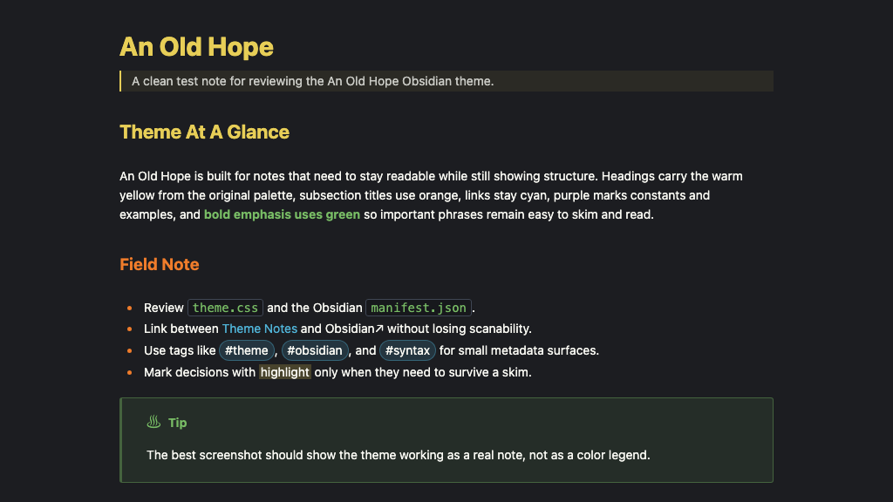

# An Old Hope for Obsidian

A dark Obsidian theme inspired by a galaxy far, far away, porting the An Old Hope palette to modern Obsidian with styled Markdown, callouts, graph view, canvas, and editor syntax.

## Preview



An Old Hope keeps the original editor theme's backbone: deep charcoal backgrounds, warm off-white text, red keywords/actions, cyan links and strings, yellow headings/functions, green Markdown/code accents and bold emphasis, orange accents, and purple constants. Green gives bold prose a strong, readable skim signal without competing with headings or making ordinary emphasis look like an alert.

## Galactic graph view

Global and local graphs become a dedicated night-mode cartography display in both app color modes. Native Obsidian nodes and links remain fully interactive above a CSS-only star field, concentric range rings, center bearings, scanlines, and a restrained CRT vignette. Focused notes read as warm navigation targets, tags and attachments retain their semantic palette colors, and the graph settings use a compact navigation-computer panel.

The wider interface borrows only the motifs that improve hierarchy: telemetry-style status text, a cyan instrument edge on transient panels, monospaced callout headers, and schematic framing for Canvas controls. Document surfaces remain quiet and readable instead of turning every note into a cockpit prop.

## Install

### Manual install

1. Download this repository.
2. Copy `manifest.json` and `theme.css` into this folder in your vault:

   ```text
   <your-vault>/.obsidian/themes/An Old Hope/
   ```

3. Restart Obsidian if this is the first install or if `manifest.json` changed.
4. Open `Settings -> Appearance -> Themes` and choose `An Old Hope`.

### Development install

From your vault's theme directory, clone the repository into a folder named exactly `An Old Hope`:

```sh
cd /path/to/your-vault/.obsidian/themes
git clone https://github.com/banastas/an-old-hope-obsidian-theme.git "An Old Hope"
```

Obsidian expects the theme folder name to match the `name` in `manifest.json`.

## Files

- `manifest.json`: Obsidian theme metadata.
- `theme.css`: the complete Obsidian theme.
- `scripts/validate-obsidian-theme.mjs`: a lightweight validation check for the theme package.

## Development

Run the validation check before publishing:

```sh
npm test
```

The validator checks that the manifest matches the expected Obsidian theme shape, the original An Old Hope palette is present, key Obsidian selectors and variables exist, the CSS has balanced braces/comments/strings, and text-bearing purple roles meet WCAG AA contrast in both color modes.

## Credits

The An Old Hope palette began with [Jesse Leite's original Atom syntax theme](https://github.com/jesseleite/an-old-hope-syntax-atom). Bill Anastas used that Atom theme as the base for the [VS Code and Sublime ports](https://github.com/banastas/an-old-hope-theme), and this Obsidian version was created from those ports.

This repository adapts that lineage for Obsidian's modern theme CSS, including the app shell, Markdown editor, reading view, callouts, graph view, canvas, and editor syntax.

## License

MIT

## Publishing releases

1. Update `version` in both `manifest.json` and `package.json` and run `npm test`.
2. Commit and push the changes to `main`.
3. Create and push a tag that exactly matches the manifest version (for example, `1.1.1`, without a `v` prefix).

The **Publish theme** GitHub Actions workflow validates the tagged source, creates a GitHub Release if needed, and attaches `manifest.json` and `theme.css` directly as downloadable assets. It downloads both assets again and compares them byte for byte with the tagged files. Repository files and GitHub's automatic source archives alone do not satisfy Obsidian's install-file checks.

Publishing a release through GitHub also triggers the workflow. To repair an existing release, run **Publish theme** manually from the Actions tab and enter its existing tag. This uses the files from that tag, preserves the release notes, and replaces the two install assets. No version bump is needed for missing assets when the theme itself has not changed.

The **Validate theme** workflow runs the theme checks on pull requests and pushes to `main`. A successful publishing run verifies GitHub assets; the Obsidian directory review is a separate check and may need to run again before its status changes.
